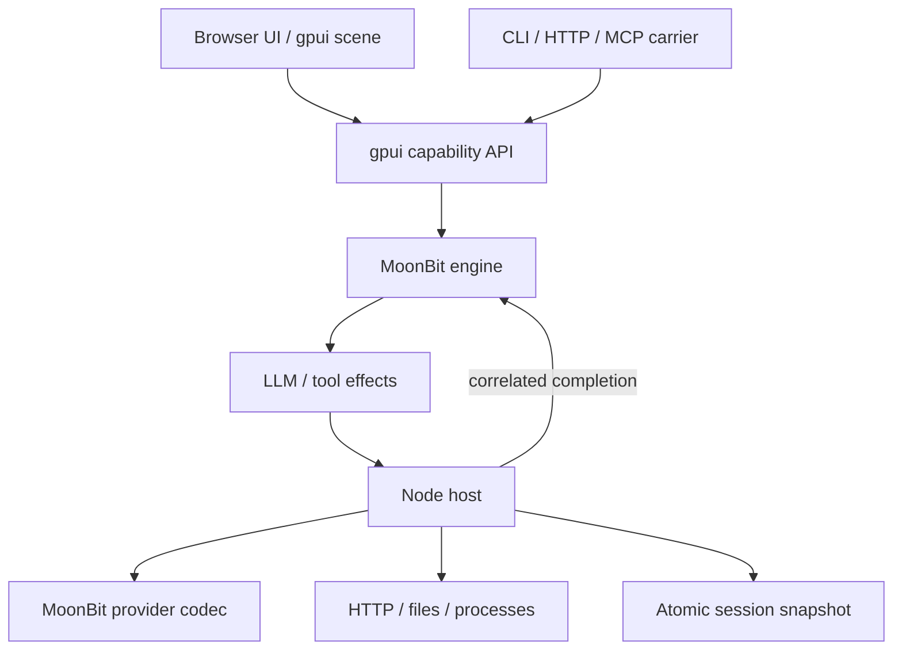

# アーキテクチャ

## 実行境界

MoonBit が domain state と provider protocol を所有し、host は I/O の実行と永続化を担当します。
JavaScript に agent loop の別実装はありません。



| ディレクトリ | 責務 |
| --- | --- |
| `engine/` | セッション、連続したイベント、履歴 projection、turn / step、承認、effect、復元検証 |
| `provider/` | DeepSeek Messages / OpenAI Chat Completions の request、JSON response、incremental SSE decoder |
| `plugins/` | MoonBit startup composition、依存・所有権検証、6 種の tool schema |
| `api/` | gpui `App` / registry / typed capability / GUI binding / MCP、hotpath 計測 |
| `ui/` | gpui による transcript layout、visible scene、scroll bounds |
| `app/` | 明示的な start / stop と JSON を使う JavaScript FFI |
| `host/` | HTTP、CLI、provider transport、workspace tools、atomic persistence、shutdown |
| `web/` | gpui Canvas renderer、DOM 操作、polling、再接続、Text view |

## 状態遷移と effect

1. `session_send` が user message と turn 開始を記録し、`llm` effect を作る。
2. host は状態の checkpoint を保存した後に provider I/O を開始する。
3. MoonBit provider codec が response を共通形式へ正規化する。
4. `complete(effect_id, result)` が outstanding ID を検証する。
5. tool がある場合は schema を検証し、read を開始するか、write / shell の承認を待つ。
6. host は承認の記録も保存してから実行する。結果を `complete` に戻し、次の LLM step に進む。
7. tool のない最終応答で `completed`。cancel、provider error、step / token / capacity 上限は明示的に終了する。

tool は呼出し順に直列実行します。unknown tool、不正な引数、承認拒否は対応する tool result にエラーとして残り、
モデルが次の step で回復を試みられます。truncated tool arguments は実行しません。

現在の SSE decoder は分割された text / reasoning / tool arguments を逐次解析しますが、
engine への反映は response 全体が正常終了した時点です。UI の token 単位更新はまだありません。

### 所有権と終了処理

engine は JSON 入出力をコピーし、外部参照から履歴や policy を書き換えられないようにします。
mutating operation は candidate state に適用し、容量と終了可能性を検証してから commit します。
拒否された send / approval による部分更新はありません。

effect ID は engine 内の単調増加 ID に app incarnation を付けて公開します。
古い `stop` / `start` 間の完了通知、cancel 後の応答、重複した完了通知は新しい turn を進めません。
同じ JavaScript facade を複数 host が同時に所有することも拒否します。

host の state mutation と checkpoint は直列化します。shutdown は新しい I/O の開始を止め、
fetch / subprocess を abort して終了を待ち、最後に lock と gpui 所有オブジェクトを解放します。
checkpoint に失敗した場合は新しい外部作用を続行せず、host を失敗状態にします。

## 永続化と容量

ローカルの保存形式は **`dsh.mbt-session-v1`** です。明示的な `session_import` は upstream
Session v4 JSONL を厳密に読み取り、header と各 raw source line をこの snapshot の中に保持します。
Session v4 の自動 restore migration や v4 writer はありません。read-only importer は basic message/tool lifecycle、
inbox splice と第一階層 fork に加え、限定的な developer/header 更新、current-surface replacement、compaction
checkpoint/pruning、診断用 assistant attempt、inert skill/image references、correlated PTC/subagent/foreground-workflow
history を扱います。image bytes は解決せず placeholder を表示し、workflow background mode は拒否します。
live compaction、retry scheduling、tool/subagent/workflow execution は実装しません。2026-10-07 の catalog regression は
unmodified upstream snapshot 25 件すべての import / reopen、transcript/correlation、effect がないことを検証します。
詳細な受理範囲と拒否条件は
[移植状況](port-status.md) を参照してください。全 session の event log と派生
messages を、単一 writer の atomic snapshot として保存します。一時ファイル、fsync、rename を使い、
未完了の書込みを次回の正常な履歴として読みません。

restore は identity、event sequence、turn / step、tool correlation、message projection を検証します。
import 済み history の restore は保存した v4 archive 全体を再 decode し、raw envelope、派生 transcript、
status、pending inbox、tool outcome の一致を確認します。imported history は UI でも read-only と表示し、
prompt を無効にします。以前の v1 snapshot が元の append-only subset に対する旧 transcript projection と
完全一致するときだけ、新 projection に正規化して復元します。部分的な旧 projection や行の改変は拒否します。
import と再オープンは provider/tool effect を発行しません。
通常の runtime session で保存時に実行中だった turn は interruption として閉じます。
**既に承認された tool も自動再実行しません。** runtime history はその結果を確認して新しい turn を送信できます。
import 済み v4 history は immutable な履歴であり、新しい turn も cancel も受け付けません。

初期版には次の上限があります。

| 項目 | 上限 |
| --- | --- |
| セッション数 | 32 |
| 1 セッションの canonical JSON | 262,144 UTF-16 code units。events と messages、終了時の記録余地を含む |
| 1 prompt | 16,384 文字 |
| engine が受け取る response text / tool arguments / tool result | 各 65,536 文字 |
| host が返す tool output | UTF-8 で 65,536 bytes、打切りマーカー込み |
| 1 model step の tool 数 | 16 |
| 1 turn の model step | 既定 16、指定範囲 1–64 |
| HTTP request / MCP line / CLI import file | 1 MiB |

capacity を超える completion は、採用前の履歴を保ったまま `session_capacity` で失敗として閉じます。
その candidate から作られた tool / LLM effect は送出しません。続行には新しい session を作成してください。
この制限により gpui の応答サイズ、snapshot の読込上限、終了時の error 記録を同時に満たします。

## HTTP / capability API

| Endpoint | 内容 |
| --- | --- |
| `GET /health` | host status と backend の mode / model |
| `GET /api/state` | UI 用の session snapshot |
| `POST /api/call` | `{operation, input}` を gpui registry に dispatch |
| `POST /mcp` | gpui が扱う JSON-RPC request / response |

listen address は loopback に限定します。Host / Origin 検証と body 上限を適用し、static file は許可した asset のみを提供します。
public deployment や multi-user authentication は未実装です。

| 操作 | 入力 | 結果 |
| --- | --- | --- |
| `session_create` | 任意の `id`, `title`, `system_prompt`, `max_steps` | 作成した session |
| `session_import` | `jsonl` に upstream Session v4 archive | 検証済み read-only history |
| `session_list` | `{}` | `id`, `title`, `status`, `turn_id`, `step` の要約配列 |
| `session_get` | `session_id` | events / messages / pending approval を含む session |
| `session_send` | `session_id`, `prompt` | 受理後の session |
| `session_cancel` | `session_id` | 停止した session |
| `tool_approve` | `session_id`, `call_id`, `approved` | 判定後の session |
| `plugin_list` | `{}` | startup composition と tool 所有者 |
| `profile_stats` | `{}` | hotpath の集計 report 文字列 |

各操作の入力は additional properties を認めません。typed GUI binding にも同じ検証を適用します。
`session_send` は実行中の session への重複投入を拒否します。
import 済み history は `session_send` と `session_cancel` を拒否します。permission preset、approval policy、sandbox mode は
元の履歴としてだけ保持し、host の設定や capability admission に反映しません。
クライアントが再送する create には明示的な `id` を使用できます。
JSON-RPC の `id` は応答の相関用であり、同じ ID の request を自動 deduplicate するものではありません。

### gpui MCP の具体例

固定 gpui revision の stateless protocol は `2026-07-28` です。
`server/discover`、`tools/list`、`tools/call`、`resources/list`、`resources/read` を利用できます。
`_meta` は gpui protocol が要求するものです。

```json
{
  "jsonrpc": "2.0",
  "id": "example-1",
  "method": "tools/call",
  "params": {
    "_meta": {
      "io.modelcontextprotocol/protocolVersion": "2026-07-28",
      "io.modelcontextprotocol/clientCapabilities": {}
    },
    "name": "session_list",
    "arguments": {}
  }
}
```

成功した tool response の `result.structuredContent` は **JSON をエンコードした string** です。
MCP client はその string を 1 回 JSON decode します。HTTP `/api/call` では MoonBit の `HarnessApi::invoke()` が
capability の string を JSON decode し、facade が生成した `{ok, result}` を carrier が返します。
output schema も string として公開しており、構造化 object schema を偽って宣言しません。

CLI carrier は JSON-RPC 1 行につき 1 message の stdio framing です。
旧版 handshake / Content-Length framing への変換や、upstream MCP client による外部 tool 取込は提供していません。

## gpui とツール群

`ui/transcript.mbt` は gpui flex layout、ElementTree、SceneSnapshot を生成します。
browser は upstream 由来の Canvas renderer で scene を描きます。長い transcript のうち visible range だけを scene に入れ、
Canvas bitmap は viewport サイズに保ちます。DOM は textarea、button、session navigation、読み上げ可能な transcript を提供します。

`api/api.mbt` は gpui `App` を作成し、owned capability registry と protocol server をその寿命に結び付けます。
`hotpath.Profiler` が capability ごとの実際の呼出しを計測します。
`plugins/` は compile 時に組み込む MoonBit tool descriptor の依存と重複を検証します。
一覧中の session / loop / provider / UI / API は startup component の記録であり、Cordis の実行時 plugin loader ではありません。

`turtles` は production `plugins/` を毎回 byte-for-byte で一時 module にコピーして実行します。
入力 hash を report に添え、実行中に元ファイルが変わると gate を失敗させます。
mutation 用に簡略化した別実装を保守することはありません。

## 参照

- [Upstream agent loop](https://github.com/deepseek-ai/deepseek-harness/tree/5badb15009ae1756c3afe0ae0cef1faafc290ccc/packages/core/agent-loop)
- [Upstream session](https://github.com/deepseek-ai/deepseek-harness/tree/5badb15009ae1756c3afe0ae0cef1faafc290ccc/packages/core/session)
- [Upstream provider](https://github.com/deepseek-ai/deepseek-harness/tree/5badb15009ae1756c3afe0ae0cef1faafc290ccc/packages/llm/llm-deepseek)
- [gpui fixed revision](https://github.com/gpui-mbt/gpui.mbt/tree/7335e13abe85c65d2a0f60571adc68faa8e64cdd)
- [Engine contract](../engine/README.md)、[Provider contract](../provider/README.md)
