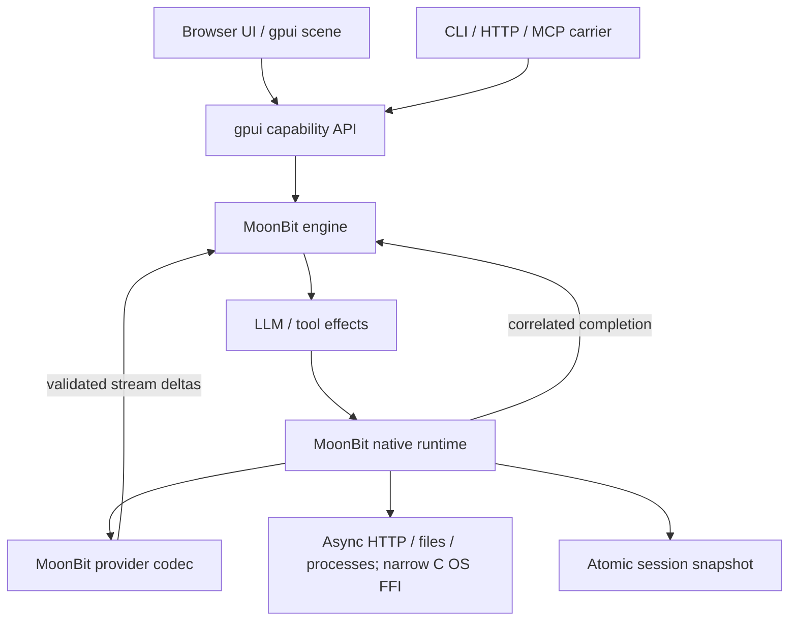

# アーキテクチャ

## 実行境界

MoonBit が domain state、provider protocol、agent loop、CLI / HTTP / MCP service と browser UI を所有します。
native runtime は async HTTP / filesystem / process API と narrow C FFI を通じて外部作用を実行し、checkpoint を保存します。
product logic を持つ handwritten JavaScript / TypeScript runtime はありません。



| ディレクトリ | 責務 |
| --- | --- |
| `engine/` | セッション、連続したイベント、履歴 projection、turn / step、承認、effect、復元検証 |
| `provider/` | DeepSeek Messages / OpenAI Chat Completions の request、JSON response、incremental SSE decoder |
| `plugins/` | MoonBit startup composition、依存・所有権検証、6 種の tool schema |
| `api/` | gpui `App` / registry / typed capability / GUI binding / MCP、hotpath 計測 |
| `ui/` | gpui による transcript layout、visible scene、scroll bounds |
| `app/` | MoonBit application composition と明示的な start / stop boundary |
| `runtime/` | Native CLI / HTTP / MCP、provider transport、workspace tools、atomic persistence、scheduler、shutdown library |
| `native/`, `cmd/dsh/` | `moon run native` と `moon install ./cmd/dsh` 向けの薄い executable entrypoints |
| `browser/`, `web/` | MoonBit browser / service-worker package、生成 JavaScript、pinned static CSS |

## 状態遷移と effect

1. `session_send` が user message と turn 開始を記録し、`llm` effect を作る。
2. native runtime は状態の checkpoint を保存した後に provider I/O を開始する。
3. MoonBit provider codec が完全に検証した SSE frame の text / reasoning delta を native runtime が drain し、
   `stream_project(effect_id, content, reasoning)` が active turn / step に provisional event を記録する。
4. native runtime は最大 4096 UTF-16 code units の batch（Unicode scalar 境界を維持）を checkpoint し、browser と session API
   が stream 中に provisional transcript を表示できる。partial row は provider の次の model context には含めない。
5. EOF で decoder が response を共通形式へ正規化し、`complete(effect_id, result)` が outstanding ID と
   projected delta との一致を検証する。
6. tool がある場合は schema を検証し、read を開始するか、write / shell の承認を待つ。
7. native runtime は承認の記録も保存してから実行する。結果を `complete` に戻し、次の LLM step に進む。
8. tool のない最終応答で `completed`。cancel、provider error、step / token / capacity 上限は明示的に終了する。

`effect: "read"` として登録した連続 call は、最大 4 件の bounded rolling pool で並列実行します。native runtime は
すべての `tool/request` を checkpoint してから IO を開始します。読み取りが返る順は自由ですが、受理した completion は
call ID と effect ID の組として永続化し、tool result と次の model context には元の call 順で追加します。pool が空くと
同じ Read group の次の call を開始します。最大数は upstream の既定 10 ではなく、この port の 4 です。

`Write` と `Shell` は 1 call ごとの承認 barrier です。unknown tool と schema-invalid call も fail-closed barrier とし、
先行 Read group を drain してから error result を記録します。別々の plugin effect を Read に分類するかどうかは
startup descriptor の静的 policy です。truncated arguments や未登録 tool は IO しません。cancel は新しい Read の補充を止め、
既に受理した成功結果を保ちながら実行中・未開始 call を結果不明の error として閉じます。restore は中断時の不明な IO を
再実行しません。

SSE decoder は分割された text / reasoning / tool arguments を逐次解析します。完全に検証された text / reasoning frame
だけが stream event になり、tool arguments や reasoning signature は projection しません。native runtime は有限の 16 Mi-unit
queue に Unicode scalar 境界を守った segment として追加し、onDelta callback 自身は state mutation や checkpoint を
待ちません。MoonBit state mutation と checkpoint は serialized owner だけが実行し、512 code units ごと、または
100 ms ごとに bounded batch を engine に渡します。cancel preflight は進行中 callback と projection/checkpoint を
quiescence まで drain してから engine cancellation を記録するため、遅れた古い snapshot が最後に保存されません。
最終 completion は投影済み内容と
一致しなければ受理されず、partial / failed / cancelled turn は useful な provisional text を履歴に残します。
provisional row は accessible name と Canvas scene label で writing / partial と示し、final row が同じ turn / step
を置き換えるため duplicate transcript はできません。restore は stream event を検証して partial を再表示しますが、
effect は再発行しません。通常 CLI text stdout は final assistant message のみを表示し、`--json` は session snapshot
を返すため partial / failed / cancelled turn の provisional row も含むことがあります。live compaction と spill は後続 parity work です。

### Manual tool-result pruning

`session_prune_tool_results` は、idle または completed の native v1 session に対する明示的な state-change operation です。
active turn、approval 待ち、read-only Session v4 import には適用できません。browser の **Trim outputs**、HTTP / gpui API、
または `dsh prune-session SESSION_ID` から実行できます。

この処理は upstream の pinned
[compaction-tool-result-pruner](https://github.com/deepseek-ai/deepseek-harness/tree/5badb15009ae1756c3afe0ae0cef1faafc290ccc/packages/compaction/compaction-tool-result-pruner)
の head / marker / tail policy を参照しています。既定値は trigger 8,192 code points、head 4,096、tail 1,024 で、
marker は `\n\n[... tool result middle pruned ...]\n\n` です。API の任意 field
`threshold_chars`、`head_chars`、`tail_chars` は整数として厳密に検証し、marker を含む出力長が threshold 以下であることを要求します。
CLI はそれぞれ `--threshold-chars`、`--head-chars`、`--tail-chars` を受け付けます。切り出しは MoonBit の Unicode code point
境界で行うため surrogate pair を分割しません。同じ policy の再適用は idempotent で、より小さい policy は現在の projection から続けます。

pruning は original `tool/result` を変更せず、source / call identity、budgets、code point counts、projected content を持つ
`tool/result/pruned` event を追加します。restore は参照 sequence、call identity、budgets、counts、再計算した content を照合します。
`Session.messages()` と transcript には full original output を残し、browser は該当する行に “trimmed for model context” と表示します。
次の provider request は replay 検証済み event から組み立てた projection を使います。native runtime の serialized mutation path が
成功した操作を checkpoint してから応答するため、保存失敗は session update を公開せず、provider/tool I/O も開始しません。

これは手動の bounded projection です。token meter、pressure trigger、summary generation、自動 live compaction、spill は含みません。
pruning event は保存量を増やし、canonical session の 262,144 UTF-16 code unit 上限と 32,768 event 上限は引き続き適用されます。
capacity refusal は candidate snapshot を採用せず、元の transcript / event queue を保ちます。運用上の条件は
[次の移植作業](../issues/open/0001-upstream-parity.md) を参照してください。

### Durable provider retry

`engine/retry.mbt` が retry eligibility、attempt budget、delay、effect / turn / step identity を決めます。native runtime は provider error を
stable code に分類し、`llm/retry` を append して atomic snapshot に保存した後だけ cancellable backoff を始めます。
backoff が完了したら MoonBit が `llm/retry-started` を append し、2 回目の checkpoint が成功した後だけ次の request を送ります。
途中の failure や保存失敗では次の provider call を開始しません。restore 時の pending retry は通常の interrupted turn として閉じ、
未確定の provider outcome を再送しません。

default は最大 5 retries、500 ms 初期遅延、10,000 ms 上限です。delay は deterministic exponential で、upstream の jitter は
実装していません。positive `Retry-After` が上限以内ならその delay を使い、上限を超えた場合は retry を中止します。
`EMPTY_RESPONSE`, `RATE_LIMIT`, `SERVER`, `TIMEOUT`, `TRANSPORT` だけを対象にし、auth、HTTP 408 / 429 以外の 4xx、malformed response は
再試行しません。stream callback で text / reasoning が観測された request も retry しません。再試行は同一の immutable request と
active LLM effect 上で行い、tool dispatch は provider response が正常に得られてから一度だけ行います。各再試行は新しい provider
request であり、再度課金される場合があります。CLI は `--max-retries 0..5` を公開します。

この narrow port は upstream [retry executor](https://github.com/deepseek-ai/deepseek-harness/blob/5badb15009ae1756c3afe0ae0cef1faafc290ccc/packages/llm/llm-retry/src/index.ts)
と [retry policy](https://github.com/deepseek-ai/deepseek-harness/blob/5badb15009ae1756c3afe0ae0cef1faafc290ccc/packages/llm/llm/src/retry-policy.ts)
の lifecycle / transient categories を参照していますが、`always` mode、policy keying、jitter、downstream composition は移植していません。
read-only Session v4 importer は upstream `llm/retry` / `llm/retry-started` の schema と lifecycle correlation を検証し、
native / shorthand archive の raw history に保持します。これは metadata import のみで、retry wait や provider request は再生しません。

### 所有権と終了処理

engine は JSON 入出力をコピーし、外部参照から履歴や policy を書き換えられないようにします。
mutating operation は candidate state に適用し、容量と終了可能性を検証してから commit します。
拒否された send / approval による部分更新はありません。

effect ID は engine 内の単調増加 ID に app incarnation を付けて公開します。
古い `stop` / `start` 間の完了通知、cancel 後の応答、重複した完了通知は新しい turn を進めません。
各 native runtime は独自の API、store、workspace owner を持ち、command receipt の identity と data-directory lock で所有権を分離します。

native runtime の state mutation と checkpoint は直列化します。shutdown は新しい delta callback の登録を止め、
すでに受理した callback と queue の全 batch を serialized owner が drain してから engine の cancel と最終
checkpoint を行います。fetch / subprocess も abort して終了を待ち、最後に lock と gpui 所有オブジェクトを解放します。
checkpoint に失敗した場合は新しい外部作用を続行せず、runtime を失敗状態にします。

## 永続化と容量

ローカルの保存形式は **`dsh.mbt-session-v1`** です。明示的な `session_import` は upstream
Session v4 JSONL を厳密に読み取り、header と各 raw source line をこの snapshot の中に保持します。
Session v4 の自動 restore migration や v4 writer はありません。read-only importer は basic message/tool lifecycle、
inbox splice と第一階層 fork に加え、限定的な developer/header 更新、current-surface replacement、compaction
checkpoint/pruning、診断用 assistant attempt、inert skill/image references、correlated PTC/subagent/foreground-workflow
history を扱います。image bytes は解決せず placeholder を表示し、workflow background mode は拒否します。
live compaction と tool/subagent/workflow execution は実装しません。限定的な provider retry は v1 runtime にあります。
read-only importer は upstream retry event の schema / correlation を検証して raw rows として保持し、assistant-less step の後に
schedule/start が続く upstream terminal ordering も受理します。これらの event を再生しません。2026-10-07 の catalog regression は
unmodified upstream snapshot 25 件すべての import / reopen、transcript/correlation、effect がないことを検証します。
詳細な受理範囲と拒否条件は
[移植状況](port-status.md) を参照してください。全 session の event log と派生
messages を、単一 writer の atomic snapshot として保存します。一時ファイル、fsync、rename を使い、
未完了の書込みを次回の正常な履歴として読みません。

restore は identity、event sequence、turn / step、tool correlation、message projection を検証します。
import 済み history の restore は保存した v4 archive 全体を再 decode し、raw envelope、派生 transcript、
status、pending inbox、tool outcome の一致を確認します。imported history は UI でも read-only と表示し、
prompt を無効にします。以前の v1 snapshot が元の append-only subset に対する旧 transcript projection と
完全一致するときだけ、新 projection に正規化して復元します。部分的な旧 projection や行の改変は拒否します。
import と再オープンは provider/tool effect を発行しません。
通常の runtime session で保存時に実行中だった turn は interruption として閉じます。
**既に承認された tool も自動再実行しません。** runtime history はその結果を確認して新しい turn を送信できます。
import 済み v4 history は immutable な履歴であり、新しい turn も cancel も受け付けません。

初期版には次の上限があります。

| 項目 | 上限 |
| --- | --- |
| セッション数 | 32 |
| 1 セッションの canonical JSON | 262,144 UTF-16 code units。events と messages、終了時の記録余地を含む |
| 1 prompt | 16,384 文字 |
| engine が受け取る response text / tool arguments / tool result | 各 65,536 文字 |
| native runtime が返す tool output | UTF-8 で 65,536 bytes、打切りマーカー込み |
| 1 model step の tool 数 | 16 |
| 1 turn の model step | 既定 16、指定範囲 1–64 |
| HTTP request / MCP line / CLI import file | 1 MiB |

capacity を超える completion は、採用前の履歴を保ったまま `session_capacity` で失敗として閉じます。
その candidate から作られた tool / LLM effect は送出しません。続行には新しい session を作成してください。
この制限により gpui の応答サイズ、snapshot の読込上限、終了時の error 記録を同時に満たします。

## HTTP / capability API

| Endpoint | 内容 |
| --- | --- |
| `GET /api/metadata` | workspace、repository、provider、model の安全な表示情報 |
| `GET /api/v1/snapshot` | workspace identity と UI 用 snapshot |
| `GET /api/v1/sessions/{id}` | session projection |
| `GET /api/v1/events` | cursor / session scope 付き event stream |
| `GET /api/v1/commands/{id}` | durable command receipt |
| `POST /api/v1/commands` | versioned remote command を受け付ける |
| `POST /api/call` | `{operation, input}` を gpui registry に dispatch |
| `POST /mcp` | gpui が扱う JSON-RPC request / response |
| `GET /` と allowlist static paths | compiled browser / service-worker assets、pinned CSS、PWA metadata |

listen address は loopback に限定します。Host / Origin 検証と body 上限を適用し、static file は許可した asset のみを提供します。
public deployment や multi-user authentication は未実装です。

| 操作 | 入力 | 結果 |
| --- | --- | --- |
| `session_create` | 任意の `id`, `title`, `system_prompt`, `max_steps` | 作成した session |
| `session_import` | `jsonl` に upstream Session v4 archive | 検証済み read-only history |
| `session_list` | `{}` | `id`, `title`, `status`, `turn_id`, `step` の要約配列 |
| `session_get` | `session_id` | events / messages / pending approval を含む session |
| `session_send` | `session_id`, `prompt` | 受理後の session |
| `session_prune_tool_results` | `session_id` と任意の pruning budgets | session、pruned result summary、removed code point 数 |
| `session_cancel` | `session_id` | 停止した session |
| `tool_approve` | `session_id`, `call_id`, `approved` | 判定後の session |
| `plugin_list` | `{}` | startup composition と tool 所有者 |
| `profile_stats` | `{}` | hotpath の集計 report 文字列 |

各操作の入力は additional properties を認めません。typed GUI binding にも同じ検証を適用します。
`session_send` は実行中の session への重複投入を拒否します。
import 済み history は `session_send`、`session_prune_tool_results`、`session_cancel` を拒否します。permission preset、approval policy、sandbox mode は
元の履歴としてだけ保持し、host の設定や capability admission に反映しません。
クライアントが再送する create には明示的な `id` を使用できます。
JSON-RPC の `id` は応答の相関用であり、同じ ID の request を自動 deduplicate するものではありません。

### gpui MCP の具体例

固定 gpui revision の stateless protocol は `2026-07-28` です。
`server/discover`、`tools/list`、`tools/call`、`resources/list`、`resources/read` を利用できます。
`_meta` は gpui protocol が要求するものです。

```json
{
  "jsonrpc": "2.0",
  "id": "example-1",
  "method": "tools/call",
  "params": {
    "_meta": {
      "io.modelcontextprotocol/protocolVersion": "2026-07-28",
      "io.modelcontextprotocol/clientCapabilities": {}
    },
    "name": "session_list",
    "arguments": {}
  }
}
```

成功した tool response の `result.structuredContent` は **JSON をエンコードした string** です。
MCP client はその string を 1 回 JSON decode します。HTTP `/api/call` では MoonBit の `HarnessApi::invoke()` が
capability の string を JSON decode し、facade が生成した `{ok, result}` を carrier が返します。
output schema も string として公開しており、構造化 object schema を偽って宣言しません。

CLI carrier は JSON-RPC 1 行につき 1 message の stdio framing です。
旧版 handshake / Content-Length framing への変換や、upstream MCP client による外部 tool 取込は提供していません。

## gpui とツール群

`ui/transcript.mbt` は gpui flex layout、ElementTree、SceneSnapshot を生成します。
browser は upstream 由来の Canvas renderer で scene を描きます。長い transcript のうち visible range だけを scene に入れ、
Canvas bitmap は viewport サイズに保ちます。DOM は textarea、button、session navigation、読み上げ可能な transcript を提供します。

`api/api.mbt` は gpui `App` を作成し、owned capability registry と protocol server をその寿命に結び付けます。
`hotpath.Profiler` が capability ごとの実際の呼出しを計測します。
`plugins/` は compile 時に組み込む MoonBit tool descriptor の依存と重複を検証します。
一覧中の session / loop / provider / UI / API は startup component の記録であり、Cordis の実行時 plugin loader ではありません。

`turtles` は production `plugins/` を毎回 byte-for-byte で一時 module にコピーして実行します。
入力 hash を report に添え、実行中に元ファイルが変わると gate を失敗させます。
mutation 用に簡略化した別実装を保守することはありません。

## 参照

- [Upstream agent loop](https://github.com/deepseek-ai/deepseek-harness/tree/5badb15009ae1756c3afe0ae0cef1faafc290ccc/packages/core/agent-loop)
- [Upstream session](https://github.com/deepseek-ai/deepseek-harness/tree/5badb15009ae1756c3afe0ae0cef1faafc290ccc/packages/core/session)
- [Upstream provider](https://github.com/deepseek-ai/deepseek-harness/tree/5badb15009ae1756c3afe0ae0cef1faafc290ccc/packages/llm/llm-deepseek)
- [Upstream retry executor](https://github.com/deepseek-ai/deepseek-harness/blob/5badb15009ae1756c3afe0ae0cef1faafc290ccc/packages/llm/llm-retry/src/index.ts)
- [Upstream retry policy](https://github.com/deepseek-ai/deepseek-harness/blob/5badb15009ae1756c3afe0ae0cef1faafc290ccc/packages/llm/llm/src/retry-policy.ts)
- [gpui fixed revision](https://github.com/gpui-mbt/gpui.mbt/tree/7335e13abe85c65d2a0f60571adc68faa8e64cdd)
- [Engine contract](../engine/README.md)、[Provider contract](../provider/README.md)
